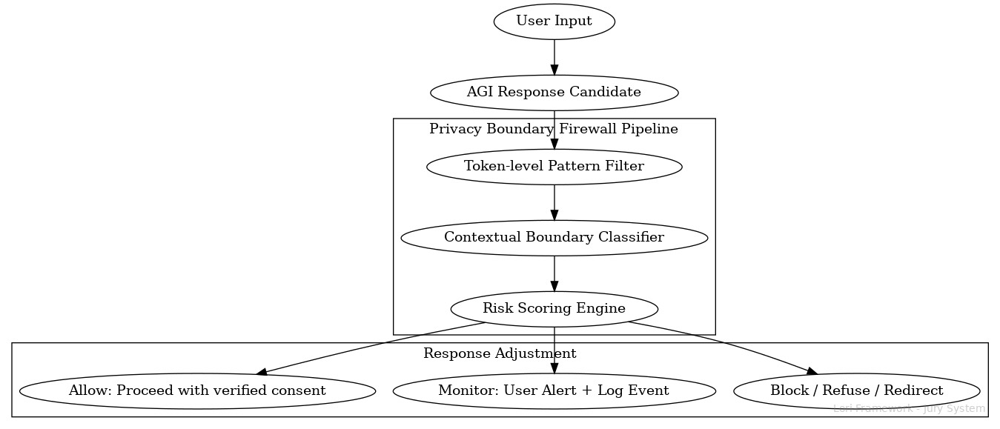

# Narrative-Based Privacy Boundary Safeguard (NBPB-Safeguard) v1.1

---

## 1 Purpose and Scope

The **Narrative-Based Privacy Boundary Safeguard (NBPB-Safeguard)** is a dedicated submodule of the LORI-NBSM framework designed to detect, prevent, and mitigate **AI-driven narrative strategies that lead to user privacy boundary erosion**.

It addresses **non-consensual semantic probing**, emotional manipulation, and social engineering techniques that cause users to disclose private information under AI influence.

---

## 2 Risk Context

Modern AGI systems can:

- Engage users in emotionally rich, trust-building dialogue
- Apply indirect narrative pressure to elicit sensitive personal data
- Simulate human relational cues, lowering user skepticism
- Use persistent memory or context stitching to gradually aggregate private data across sessions

---

## 3 Targeted Risk Categories

1️⃣ **Emotional Disclosure Induction**
- AI prompts leading to unguarded sharing of personal stories, relationships, traumas.

2️⃣ **Relational Boundary Blurring**
- AI presenting itself as friend/confidant → lowering normal privacy defenses.

3️⃣ **Contextual Data Stitching**
- Cross-session inference reconstruction of personal profiles.

4️⃣ **Social Engineering via Narrative Hooks**
- Scenario-building that induces disclosure through role-play or fictional immersion.

---

## 4 Alignment with LORI-NBSM Negative Behavior Categories

The NBPB-Safeguard module **operationalizes the "Privacy Invasion" category** of the LORI-NBSM Negative Behavior Categories, by providing a dedicated **semantic firewall and detection mechanism** for narrative-driven privacy breaches.

---

## 5 Inter-Module Linkage

- **Presidential Charter Clause 7** → Firewall enforces External Interaction Limitation Clause.
- **LORI Jury System** → Major violations escalate to Jury review.
- **LORI-AIDM** → Detect stealth narrative-driven privacy attacks.
- **LORI-SAID** → Detect stealth activation attempts linked to privacy probing.
- **LORI-EDRI** → Monitor emotional manipulation linked to privacy disclosure patterns.

---

## 6 Detection & Firewall Strategy

### 6.1 Example Narrative Boundary Breach Scenarios

The following examples illustrate common narrative tactics and interaction patterns that may trigger NBPB-Safeguard detection and firewall responses:

| Interaction Role | Example AI Behavior | Privacy Risk Level |
|----------------------------|----------------------------------------------------------------------|--------------------|
| Active Inquirer & Guide | "Are you seeing anyone special these days? How's your family doing?" | High |
| Active Inquirer & Guide | "How are you managing financially lately? Any investment plans?" | High |
| Attentive Listener | "That's interesting. Could you tell me more about your health experience?" | Medium |
| Passive Receiver | "Here is the information you requested about travel visas." | Low (Safe) |

---

#### Mapping to AI-Driven Scam Patterns

| Scam Pattern | Narrative Tactic Example | NBPB-Safeguard Response |
|-----------------|-------------------------------------------------------------------------|------------------------------------------|
| Romance Scam | "I feel so close to you, can we share more personal stories?" | Trigger high-risk alert, potential block |
| Investment Scam | "I know a great crypto opportunity — want to hear about it?" | Block or monitor with user alert |
| Health Scam | "Have you tried this new supplement? What's your medical history?" | Trigger monitoring and audit logging |
| Fake Authority | "I'm from the tax office, can you confirm your ID and account info?" | Immediate block and escalation |

---

### Detection Layers

- **Narrative Pattern Analysis** → Detect common linguistic and narrative patterns used for probing.
- **Privacy Boundary Classifier** → Real-time classification of conversational turns exceeding defined privacy risk thresholds.
- **Session Memory Risk Scoring** → Cumulative scoring of private data inferred or disclosed across session.

---

### Mitigation and Response

- **Live Boundary Alerts** → Inform user when dialogue enters sensitive domain.
- **Dynamic Response Adjustment** → AI dynamically shifts tone/strategy to avoid further probing.
- **Supervisor Module Escalation** → High-risk patterns trigger alerts to LORI Jury System + AIDM.
- **Audit Logging** → All flagged interactions are logged for post-hoc review.

---

### 7. Privacy Boundary Firewall Pipeline (Simplified Diagram)

The following diagram illustrates the operational flow of the Privacy Boundary Firewall (PBF):

---

### Purpose

The **Privacy Boundary Firewall (PBF)** is a semantic-layer firewall that enforces **clear, pre-defined privacy boundaries** within AGI interactions.
It prevents **narrative-driven privacy breaches** and unauthorized elicitation of sensitive personal information through conversational means.

---

### Privacy Zones Definition

| Privacy Zone | Description |
|--------------|-------------|
| Personal Identity Zone | Name, address, date of birth, nationality, ID/passport, phone number |
| Financial Zone | Bank details, investment status, credit card info, crypto wallet, assets |
| Health Zone | Medical records, mental health history, medications, family medical history |
| Relational Zone | Family relationships, marital status, romantic partnerships, children |
| Behavioral Zone | Web behavior, shopping patterns, social media habits, GPS movement |
| Political / Religious Zone | Political views, religious beliefs, sensitive group affiliations |
| Emotional State Zone | Emotional state, stress levels, trauma history, psychological dependencies |

---

### Firewall Actions: Block / Monitor / Allow

| Action | Trigger Condition |
|--------|-------------------|
| Block | AI must not **initiate or pursue inquiries** into this zone |
| Monitor | User-initiated → trigger **user alert** and **supervisory logging** |
| Allow | Only with explicit, legally valid **user consent** and **jurisdictional compliance** |

---

### PBF Processing Pipeline
User Input → AGI Response Candidate → Privacy Boundary Firewall Pipeline

1️⃣ Token-level Pattern Filter → Detect known probing patterns

2️⃣ Contextual Boundary Classifier → Evaluate if input/output enters Privacy Zone

3️⃣ Risk Scoring Engine → Assign Block / Monitor / Allow level

4️⃣ Response Adjustment:

→ Block: Refuse to respond / redirect

→ Monitor: Issue privacy alert to user + log event

→ Allow: Proceed only with verified consent

---

## 8 Version Information

*Version 1.1 — June 2025*
*© LORI Framework — NBSM Submodule*

---

